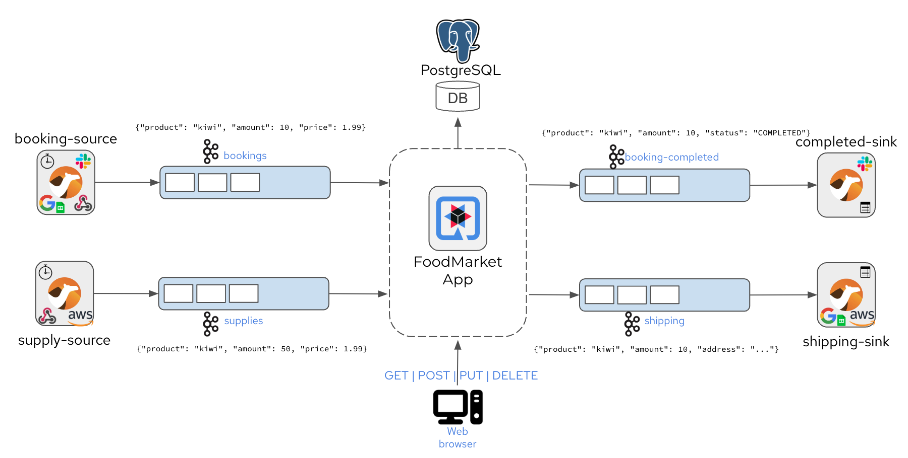

# Citrus Quarkus Demo ![Logo][1]

This project uses Quarkus to implement a sample event-driven application and shows how to verify the event processing with an automated integration test written in Citrus. 

## Objectives

The project uses the Quarkus test framework to set up a dev services environment with JUnit Jupiter where the application is running on the localhost. 
The Quarkus dev services capabilities will automatically start Testcontainers during the test in order to simulate the surrounding infrastructure 
(PostgreSQL database and the Kafka message broker).

If you want to learn more about Quarkus, please visit its website: [https://quarkus.io/](https://quarkus.io/).

## Quarkus sample application

The Quarkus sample demo application is a food market event-driven application that listens for incoming events of type `booking` and `supply`.



Users are able to add booking events. Each of them references a product and gives an amount as well as an accepted price in a simple Json object structure.

```json
{ "client": "citrus-test", "product": "Pineapple", "amount":  100, "price":  0.99 }
```

At the same time suppliers may add their individual supply events that again reference a product with an amount and a selling price.

The Quarkus application consumes both event types and as soon as bookings and supplies do match in all criteria the food market application will produce booking-completed and shipping events as a result.

All events are produced and consumed with Kafka event streams.
The domain model objects with their individual status are stored in a PostgreSQL database.

## Adding Citrus to the project

Looking at the Maven `pom.xml` you will see that Citrus is added as a test scoped dependency.
The most convenient way to add Citrus to your project is to import the `citrus-bom`.

```xml
<dependencyManagement>
    <dependencies>
      <dependency>
        <groupId>org.citrusframework</groupId>
        <artifactId>citrus-bom</artifactId>
        <version>${citrus.version}</version>
        <type>pom</type>
        <scope>import</scope>
      </dependency>
    </dependencies>
  </dependencyManagement>
```

Citrus is very modular. This means you can choose from a wide range of modules that add specific testing capabilities to the project (e.g. citrus-kafka). 
In this sample project we include the following modules as test scoped dependencies:

- citrus-quarkus
- citrus-kafka
- citrus-validation-json

The `citrus-quarkus` module provides the QuarkusTest resource implementation that enables Citrus on a Quarkus test.

```xml
<dependency>
  <groupId>org.citrusframework</groupId>
  <artifactId>citrus-quarkus</artifactId>
</dependency>
```

The other modules add very specific Citrus capabilities such as validation a Json message payload.

This completes the dependency setup. 
Now we can move on to writing an automated integration test that verifies the Quarkus application.

## Verify the Quarkus application with Citrus

In an automated integration test we need to make sure that all events are processed properly and that the resulting booking-completed and shipping events are produced as expected. This is why the Citrus test will produce booking and supply events and listen for booking-completed and shipping events accordingly.

The Citrus test is an arbitrary JUnit Jupiter unit test that uses the `@QuarkusTest` annotation in order to enable the Quarkus dev services test capabilities.
Quarkus will automatically start Testcontainers for the test that represent the PostgreSQL database and the Kakfa message broker.

You can enable the Citrus capabilities on the test by adding the `@CitrusSupport` annotation to the test class.

```java
@QuarkusTest
@CitrusSupport
class FoodMarketApplicationTest {

    private final KafkaEndpoint bookings = kafka()
            .asynchronous()
            .topic("bookings")
            .build();

    @CitrusResource
    private TestCaseRunner t;

    @Inject
    ObjectMapper mapper;

    @Test
    void shouldProcessEvents() {
        Product product = new Product("Pineapple");
        
        Booking booking = new Booking("citrus-test", product, 100, 0.99D);
        t.when(send()
                .endpoint(bookings)
                .message().body(marshal(booking, mapper)));
    }
}
```

The Citrus enabled test is able to inject additional resources that we need to interact with Citrus capabilities such as sending a message to a Kafka topic stream.
The `KafkaEndpoint` comes with the `citrus-kafka` module and allows us to send and receive messages with Kafka.
The Citrus `TestCaseRunner` represents the entrance to the Citrus Java domain specific language that allows us to run any Citrus test action (e.g. send/receive messages, verify data in an SQL database).

The test method is an arbitrary JUnit Jupiter annotated test that uses the Citrus capabilities to send a booking event to the Kafka topic.
The test is able to use the domain model objects `Product` and `Booking` as Citrus uses the injected `ObjectMapper` for the Json serialization.

The injected Citrus `TestCaseRunner` is able to use Gherkin Given-When-Then syntax and references the KafkaEndpoint `bookings` in the send operation.
This is how you can combine Citrus capabilities with Quarkus test dev services in an automated integration test.

The rest of the story is quite easy. In the same way we have sent the `booking` event we can now also send a `supply` event and receive `booking-completed` and `shipping` events in the test via Kafka endpoints.

When receiving the `booking-completed` and `shipping` events the test is able to use the Citrus Json validation power coming with the `citrus-validation-json` module. Citrus will compare the received Json object with an expected template and make sure that all fields and properties do match as expected.

```java
class FoodMarketApplicationTest {

    // ... Kafka endpoints defined here
    
    @Test
    void shouldProcessEvents() {
        Product product = new Product("Pineapple");
        
        Booking booking = new Booking("citrus-test", product, 100, 0.99D);
        t.when(send()
            .endpoint(bookings)
            .message().body(marshal(booking, mapper)));
    
        // ... also send supply events
        
        ShippingEvent shippingEvent = new ShippingEvent(booking.getClient(), product.getName(), booking.getAmount(), "@ignore@");
        t.then(receive()
            .endpoint(shipping)
            .message().body(marshal(shippingEvent, mapper))
        );
    }
}
```

The `expectedShipping` Json object uses the expected properties like the `client`, `product` and the `amount`. 
The generated `address` property gets ignored during the validation by using the `@ignored@` Citrus validation expression.

The Citrus Json validation will now compare the received shipping event with the expected Json object and fail the test when there is a mismatch.

_Citrus Json validation_
```json
{ "client":  "citrus-test", "product": "Pineapple", "amount": 100, "address": "10556 Citrus Blvd." }

compared to

{ "client":  "citrus-test", "product": "Pineapple", "amount": 100, "address": "@ignore@" }
```

The Citrus Json validation is very powerful. You can ignore properties, use validation matchers and functions, test variables and a mismatch in the order of elements is not failing the test.

## Running the Citrus tests

The Quarkus test framework uses JUnit Jupiter as a test driver.
This means you can run the tests just like any other JUnit test (e.g. from your Java IDE, with Maven).

```shell script
./mvnw test
```

The Citrus test capabilities are added on top of `@QuarkusTest` with the `@CitrusSupport` annotation.
So you will not need any other configuration to empower the tests with Citrus.

## Advanced Citrus testing

If you have a look into the code samples and the Citrus test in this repository you will see some more advanced testing capabilities in action. 
One of them is the ability of Citrus to run test actions in parallel.

```java
BookingCompletedEvent completedEvent = BookingCompletedEvent.from(booking);
completedEvent.setStatus(Booking.Status.COMPLETED.name());

ShippingEvent shippingEvent = new ShippingEvent(booking.getClient(), product.getName(), supply.getAmount(), "@ignore@");

t.then(parallel().actions(
    receive()
        .endpoint(completed)
        .message().body(marshal(completedEvent, mapper)),
    receive()
        .endpoint(shipping)
        .message().body(marshal(shippingEvent, mapper))
);
```

The parallel execution is a good idea because the events are also produced independent of each other.
The ordering of events and as they arrive is not deterministic, so we run the validation in parallel.

Also, you can iteratively send/receive messages in Citrus.

```java
Booking booking = new Booking("citrus-test", product, 10, 1.99D);
t.when(iterate().condition((i, context) -> i < 10)
    .actions(
        send()
            .endpoint(bookings)
            .message().body(marshal(booking, mapper)))
    );
```

This will send 10 booking events to the Kafka stream.

The next advanced testing capability is the use of dynamic endpoints in Citrus. 
As an alternative to creating the `KafkaEndpoint` on a test class level you can also use a dynamic endpoint URL.

```java
t.when(send()
    .endpoint("kafka:bookings")
    .message().body(marshal(booking, mapper)));

t.then(receive()
    .endpoint("kafka:completed?timeout=10000")
    .message().body(marshal(completedEvent, mapper)));
```

The endpoint URL `kafka:bookings` creates a dynamic Kafka endpoint instance to send messages to the `bookings` topic. 
The endpoint URL may also hold parameters like the receive-timeout `kafka:completed?timeout=10000`.

## Running the application in dev mode

You can run your application in dev mode that enables live coding using:
```shell script
./mvnw compile quarkus:dev
```

> **_NOTE:_**  Quarkus now ships with a Dev UI, which is available in dev mode only at http://localhost:8080/q/dev/.

## Packaging and running the application

The application can be packaged using:
```shell script
./mvnw package
```
It produces the `quarkus-run.jar` file in the `target/quarkus-app/` directory.
Be aware that it’s not an _über-jar_ as the dependencies are copied into the `target/quarkus-app/lib/` directory.

The application is now runnable using `java -jar target/quarkus-app/quarkus-run.jar`.

If you want to build an _über-jar_, execute the following command:
```shell script
./mvnw package -Dquarkus.package.type=uber-jar
```

The application, packaged as an _über-jar_, is now runnable using `java -jar target/*-runner.jar`.

## Creating a native executable

You can create a native executable using: 
```shell script
./mvnw package -Dnative
```

Or, if you don't have GraalVM installed, you can run the native executable build in a container using: 
```shell script
./mvnw package -Dnative -Dquarkus.native.container-build=true
```

You can then execute your native executable with: `./target/food-market-demo-1.1.0-runner`

If you want to learn more about building native executables, please consult https://quarkus.io/guides/maven-tooling.

## Building an image

This is meant to produce a Knative image, to be pushed to quay.io. Update the application.properties to use your own repository.

To build your image, run:
```shell script
./mvnw package -Dquarkus.container-image.build=true
```

You can push your image using:
```shell script
docker push quay.io/{YOUR_USERNAME}/food-market-demo:1.1.0
```

## Related Guides

- SmallRye Reactive Messaging - Kafka Connector ([guide](https://quarkus.io/guides/kafka-reactive-getting-started)): Connect to Kafka with Reactive Messaging
- Apache Kafka Streams ([guide](https://quarkus.io/guides/kafka-streams)): Implement stream processing applications based on Apache Kafka

[1]: https://citrusframework.org/img/brand-logo.png "Citrus"
