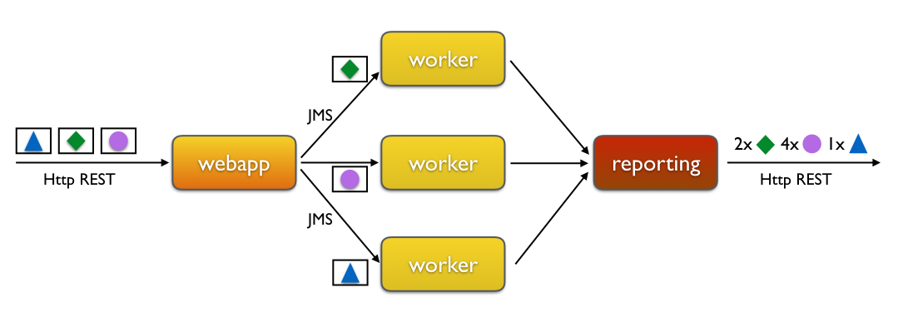
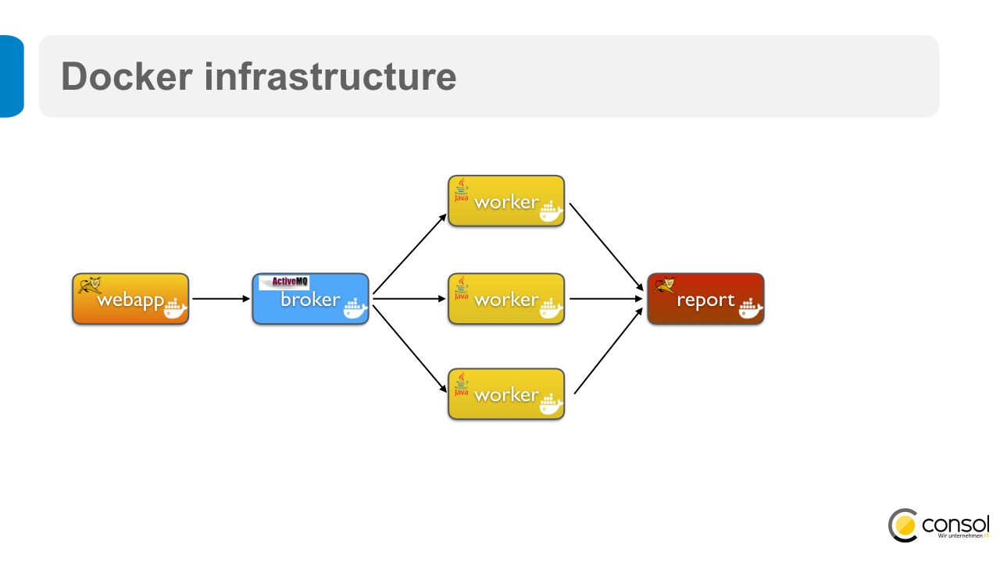

Citrus samples ![Logo][1]
==============

Bakery Demo
---------

The bakery demo sample application offers a multi module Maven project with each module being deployed in a separate
Docker container. The modules are:

* web
* worker
* report

Each of these modules provides Citrus test cases in ***src/test*** Maven test folder. The ***integration*** module contains Citrus
test cases for a complete end-to-end testing of all modules combined.

The bakery sample application uses several services that are exchanging data over various transports. Incoming order requests are routed content based
to one of the worker instances. After the worker has processed the order it will add an entry to the central reporting server. The reporting collects
all events and gives a total order processing overview to clients.



Using Docker
---------

This sample is using Docker as infrastructure for starting up the services in separate containers. If you are not able to use Docker please
continue with the embedded Jetty infrastructure described later in this README. Now back to the Docker infrastructure.



As a prerequisite to using this infrastructure you must have Docker locally installed. You can build the Docker containers 
with the famous fabric8-maven-plugin by calling

```
mvn clean package docker:build
```

You can build the Docker containers in each sub module and in the ***integration*** module. After building the images
you will be able to see some more docker images on your host.

```
docker images

REPOSITORY                TAG                 IMAGE ID            CREATED         SIZE
citrus/bakery-report      latest              a9007e0a074a        Some time ago   12.84 MB
citrus/bakery-worker      latest              c57ddba327bb        Some time ago   34.7 MB
citrus/bakery-web         latest              6c5b63a8ac11        Some time ago   17.81 MB
```

Lets start the complete Docker container infrastructure.

```
mvn -pl integration docker:start
```

After that you will then see some Docker containers started on your host

```
docker ps

CONTAINER ID        IMAGE                         COMMAND                  CREATED         STATUS          PORTS                      NAMES
2e45c4ddff48        jolokia/java-jolokia:7        "java -jar maven/work"   Some time ago   Up 2 minutes                               worker-caramel
bf50270203be        jolokia/java-jolokia:7        "java -jar maven/work"   Some time ago   Up 2 minutes                               worker-blueberry
73f24a48f56a        jolokia/java-jolokia:7        "java -jar maven/work"   Some time ago   Up 2 minutes                               worker-chocolate
18fe23c3506d        consol/tomcat-7.0:latest      "/bin/sh -c /opt/tomc"   Some time ago   Up 2 minutes    0.0.0.0:18002->8080/tcp    report-server
a8d782ae98be        consol/tomcat-7.0:latest      "/bin/sh -c /opt/tomc"   Some time ago   Up 2 minutes    0.0.0.0:18001->8080/tcp    bakery-web-server
7f0b6276df3d        consol/activemq-5.12:latest   "/bin/sh -c '/opt/apa"   Some time ago   Up 2 minutes    0.0.0.0:61616->61616/tcp   activemq-broker
```

The complete Docker sample infrastructure has been started. This includes the sample services as well as an ActiveMQ 
message broker. Now we are ready to execute some Citrus integration tests.

```
mvn -pl integration verify
```

You will see some action on the containers log output. You can also access the web UI by opening your browser pointing to

```
http://localhost:18001/bakery/
http://localhost:18002/report/
```

Once you place orders to the bakery web application you will see the reporting changes.

To stop the Docker containers run

```
mvn -pl integration docker:stop
```

Now lets run the complete lifecycle with all modules build, shipped to Docker and all Citrus tests executed

```
mvn clean install -Pdocker
```

Using embedded Jetty
---------

The sample provides an embedded Jetty option for those of you that are not having Docker installed on the localhost. You can activate
the embedded Jetty infrastructure by calling:

```
mvn clean verify -Dembedded
```

This will automatically start embedded Jetty web containers in preparation of the Maven integration-test phase. The sample application is
automatically deployed before the Citrus tests start to perform its actions.

You can also start the embedded infrastructure manually. Execute these commands in separate command line terminals:

```
mvn -pl integration activemq:run -Dembedded
mvn -pl integration jetty:run -Dembedded
```

Now the bakery sample application is started and you can execute the Citrus tests manually.

Citrus test
---------

Once the sample application is deployed and running you can execute the Citrus test cases in the module folders.
Open a separate command line terminal and navigate to the test folder.

Execute all Citrus tests by calling

     mvn verify

You can also pick a single test by calling

     mvn verify -Dit.test=<testname>

You should see Citrus performing several tests with lots of debugging output in both terminals (sample application server
and Citrus test client). And of course green tests at the very end of the build.

Of course you can also execute the tests from your favorite IDE as Java unit tests with TestNG.

Information
---------

For more information on Citrus see [www.citrusframework.org][2], including
a complete [reference manual][3].

 [1]: http://www.citrusframework.org/img/brand-logo.png "Citrus"
 [2]: http://www.citrusframework.org
 [3]: http://www.citrusframework.org/reference/html/
